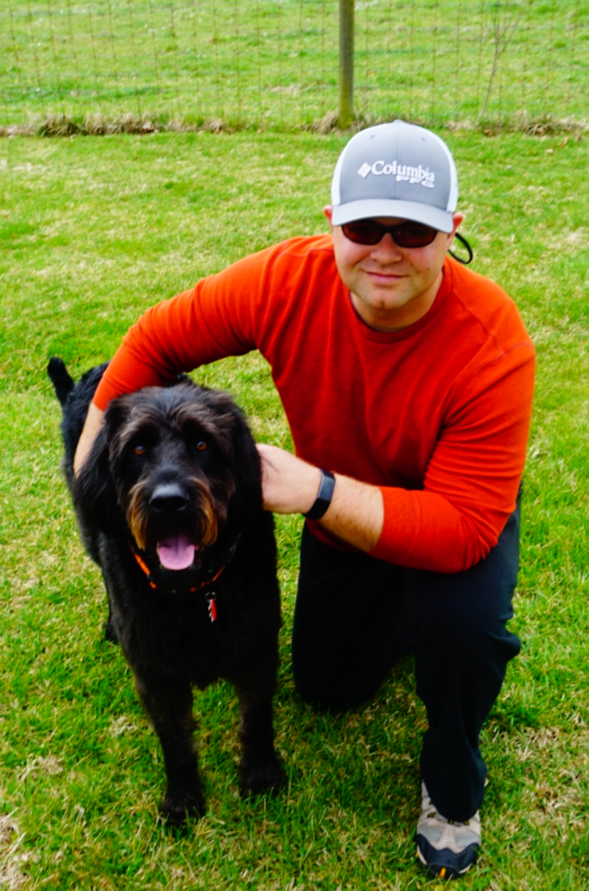

# Welcome!

Hi! I'm Zach Langford.  

I'm currently an R&D Associate at [Oak Ridge National Laboratory](https://www.ornl.gov)  in the Cyber and Applied Data Analytics Division. 

I received my PhD from [University of Tennessee](https://bredesencenter.utk.edu), advised by [Dr. Jitendra Kumar](https://climatemodeling.org/~jkumar/) and [Dr. Forrest Hoffman](https://climatemodeling.org/~forrest/). I did my masters in civil engineering at Penn State in University Park, PA, advised by [Dr. Michael Gooseff](http://goosefflab.weebly.com/).

In the past, I have spent time at Virgina Tech working on machine learning projects for national security and Boeing Research & Technology working on geospatial analytics projects for the aerospace industry.

I enjoy working on integrating multiple sources of data for understanding complex problems, which may include anomaly detection in engineering systems, dynamic modeling of systems, up-scaling field measurements for image classification, and algorithm development for noisy/under-sampled datasets (e.g., few-shot learning).

# Recent Publications

Langford, Zachary, Logan Eisenbeiser, and Matthew Vondal. 2019. “Robust
Signal Classification Using Siamese Networks.” In *Proceedings of the
Acm Workshop on Wireless Security and Machine Learning*, 1–5. WiseML. 
2019. New York, NY, USA: Association for Computing Machinery.
doi:[10.1145/3324921.3328781](https://doi.org/10.1145/3324921.3328781).

Langford, Zachary L., Jitendra Kumar, Forrest M. Hoffman, Amy L. Breen,
and Colleen M. Iversen. 2019. “Arctic Vegetation Mapping Using
Unsupervised Training Datasets and Convolutional Neural Networks.”
*Remote Sensing* 11 (1): 69.
doi:[10.3390/rs11010069](https://doi.org/10.3390/rs11010069).

